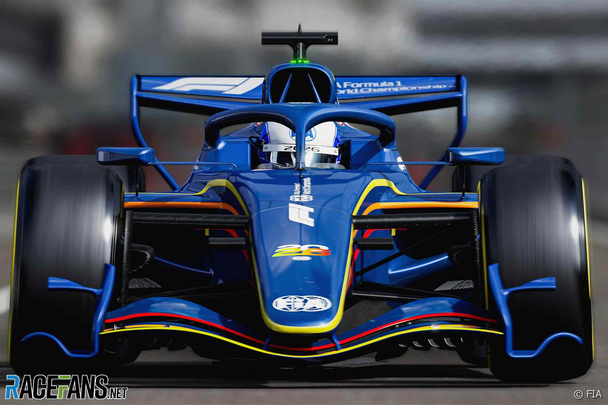
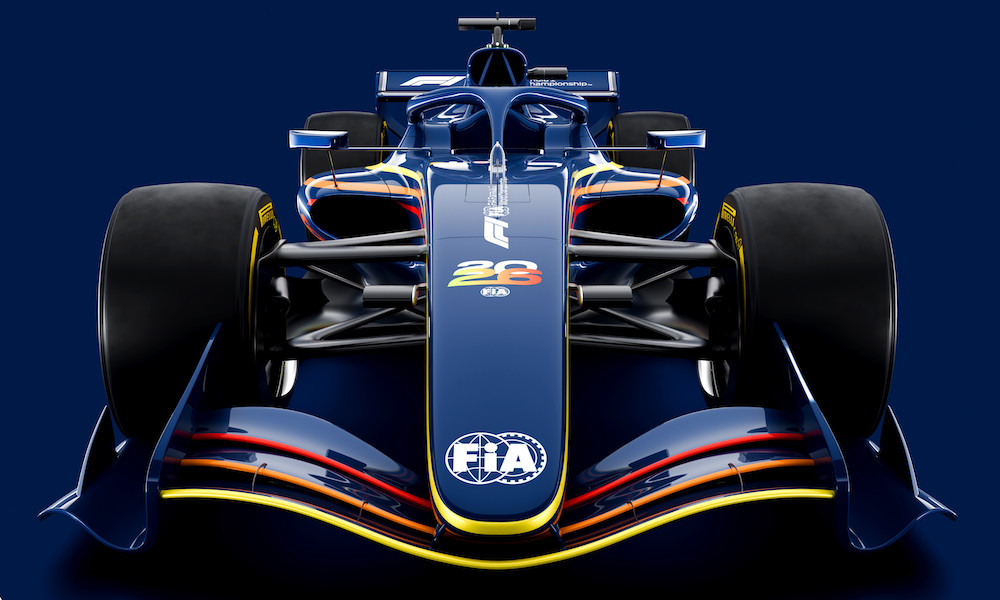
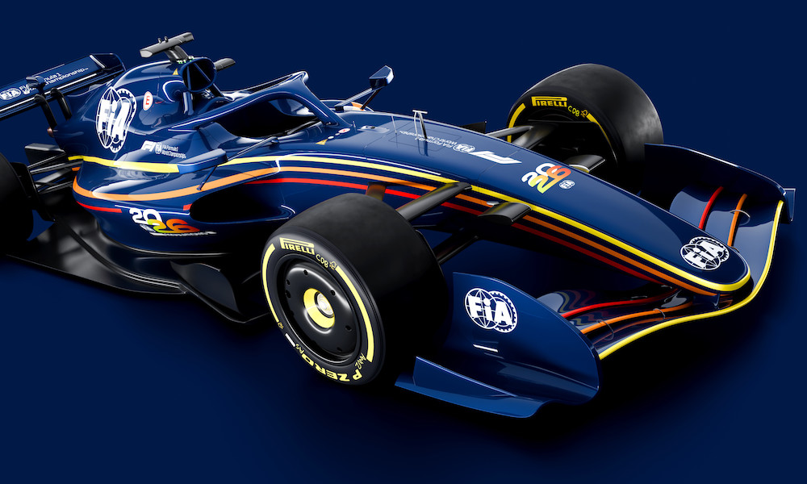
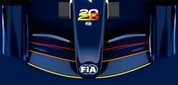
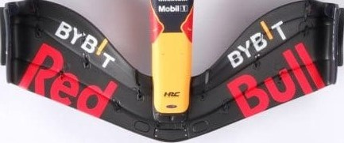
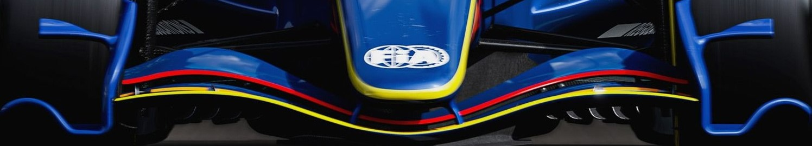

# 🏁 Practice Lap — CAD  

“And away we go! The first lap of Project: Aero. The garage doors are open, the tools are out, and the focus is on turning rough ideas into geometry that can actually be tested.”  

Hi, Saaim here👋 Welcome to the practice lap! This stage begins with the 2026 F1 regulations 📜 The new rules bring narrower cars, simplified aero and movable elements, all designed to reduce dirty air and keep racing close. Within those constraints, the target is to create a baseline front wing in Siemens NX.  

NX was chosen as the baseline CAD tool after advice from industry engineers, with CATIA as a natural future step once I’m confident in NX.

I thought about including the new active aerodynamics — Z-mode for high downforce in corners and X-mode for low drag on the straights — but decided to keep it simpler for now. That can be a future project 👀  

So before any sketches or CAD, it’s time to check the rulebook!

### 📜 FIA 2026 Front Wing Regulations (condensed)

- Maximum width reduced to **1900 mm** (100 mm narrower than 2022–25).  
- Must be a **single assembly**: mainplane, flaps, endplates, pylons.  
- Up to **4 profiles** allowed, with a fixed flap rotation axis.  
- Endplates must cover the FIA’s mandated reference boxes in both top and side views.  
- Smooth transition into the nose, with limited fillet radius (≤ 25 mm).  
- Active aero (Z/X modes) is permitted, but not included in my first version.  

**What this means for me**  
- I need to design within a narrower span and tighter FIA boxes.  
- Endplates must stay simple and legal; no overcomplicated tricks.  
- Flap geometry has to respect the fixed hinge axis.  
- Active aero is allowed in the regs, but I’ll skip it for now.  
- My target is a clean, rule-aware baseline wing that can be tested in CFD and the tunnel.  

📂 The full regulations can be found in this repo:  
`/practice-lap-CAD/fia_2026_technical_regulations.pdf`

---

### 🔎 Visual references (FIA concept)

**Front view**  

**Three-quarter renders**  
  

---

## 🧭 Build plan & scaling

I’ll model a **full-size half-span** wing in NX (so 950 mm if the full span is 1900 mm). From there I’ll produce two physical versions:

1) **Wind-tunnel test article — half-span at 25% scale**  
   - Size: **237.5 mm** span (fits my 250 mm build plate for the Bambu A1)  
   - One-piece print if possible, otherwise 2-piece with alignment pins  
   - Used for tunnel testing and comparisons to CFD

2) **Display piece — full-span at ~35% scale**  
   - Size: **~665 mm** span (for photos, not tunnel)  
   - Printed in 3–4 sections with pins & glue
   - Lets me show the full geometry without needing a huge tunnel

If the tunnel ends up smaller, I’ll drop the half-span scale to 20% to keep things practical!

---

## 🎥 Short explainers I used

- F1 2026 aero overview: https://www.youtube.com/watch?v=HIEHRR7Sy1g  
- What changes & why it matters: https://www.youtube.com/watch?v=fXPZdvkKfbA  
- Another clear breakdown of the concept car: https://www.youtube.com/watch?v=5FyFerbm6Js

---

### 🏎️ RB19 Inspiration  

The RB19 was the most dominant car of the ground effect era, winning almost every race in 2023. Its front wing was a big part of that success — not because it looked crazy, but because it was refined everywhere that mattered.  

Some highlights worth stealing:  
- The flaps tapered toward the endplate which helped push air neatly around the front tyres.  
- The outer section had just enough curvature to bias the flow outward and clean up the tyre wake.  
- The stacking line across the elements was smooth so vortices stayed stable instead of breaking up into chaos.  
- The centre section near the nose was kept simple and low drag so the wing could work hardest at the outer span.  

For my project I will use the 2026 FIA concept as the baseline but I will sneak in some RB19 flavour. Flap tapering, outer sweep and a smooth stacking line are all on the menu. The aim is not to build Red Bull’s secret sauce but to let the most successful design of recent years inspire a student version that can survive CAD CFD and eventually my wind tunnel.  

🧩 The CAD (finally)  
Here is what you are all waiting for. FINALLY, Saaim is actually going to model and show the front wing. I would also take this opportunity to say, that this is my first time using NX.  

Ever...  

Talk about jumping into the deep end, but that’s what makes it exciting 👀  

I started by adding some expressions so that scaling down would be a lot easier, which are shown below:  

---

## Reference Images

To guide the design, I brought in FIA 2026 concept renders and RB19 references (which were very hard to find).  
This way I can stay within regulations while adding some of Red Bull's innovation!

### Top View Comparison

  
  

### Front View Comparison

  
  

