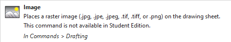

# 🏁 Practice Lap — CAD  

“And away we go! The first lap of Project: Aero. The garage doors are open, the tools are out, and the focus is on turning rough ideas into geometry that can actually be tested.”  

Hi, Saaim here👋 Welcome to the practice lap! This stage begins with the 2026 F1 regulations 📜 The new rules bring narrower cars, simplified aero and movable elements, all designed to reduce dirty air and keep racing close. Within those constraints, the target is to create a baseline front wing in Siemens NX.  

NX was chosen as the baseline CAD tool after advice from industry engineers, with CATIA as a natural future step once I’m confident in NX.

I thought about including the new active aerodynamics — Z-mode for high downforce in corners and X-mode for low drag on the straights — but decided to keep it simpler for now. That can be a future project 👀  

So before any sketches or CAD, it’s time to check the rulebook!

### 📜 FIA 2026 Front Wing Regulations (condensed)

- Maximum width reduced to **1900 mm** (100 mm narrower than 2022–25).  
- Must be a **single assembly**: mainplane, flaps, endplates, pylons.  
- Up to **4 profiles** allowed, with a fixed flap rotation axis.  
- Endplates must cover the FIA’s mandated reference boxes in both top and side views.  
- Smooth transition into the nose, with limited fillet radius (≤ 25 mm).  
- Active aero (Z/X modes) is permitted, but not included in my first version.  

**What this means for me**  
- I need to design within a narrower span and tighter FIA boxes.  
- Endplates must stay simple and legal; no overcomplicated tricks.  
- Flap geometry has to respect the fixed hinge axis.  
- Active aero is allowed in the regs, but I’ll skip it for now.  
- My target is a clean, rule-aware baseline wing that can be tested in CFD and the tunnel.  

📂 The full regulations can be found in this repo:  
`/practice-lap-CAD/fia_2026_technical_regulations.pdf`

---

### 🔎 Visual references (FIA concept)

**Front view**  

**Three-quarter renders**  
  

---

## 🧭 Build plan & scaling

I’ll model a **full-size half-span** wing in NX (so 950 mm if the full span is 1900 mm). From there I’ll produce two physical versions:

1) **Wind-tunnel test article — half-span at 25% scale**  
   - Size: **237.5 mm** span (fits my 250 mm build plate for the Bambu A1)  
   - One-piece print if possible, otherwise 2-piece with alignment pins  
   - Used for tunnel testing and comparisons to CFD

2) **Display piece — full-span at ~35% scale**  
   - Size: **~665 mm** span (for photos, not tunnel)  
   - Printed in 3–4 sections with pins & glue
   - Lets me show the full geometry without needing a huge tunnel

If the tunnel ends up smaller, I’ll drop the half-span scale to 20% to keep things practical!

---

## 🎥 Short explainers I used

- F1 2026 aero overview: https://www.youtube.com/watch?v=HIEHRR7Sy1g  
- What changes & why it matters: https://www.youtube.com/watch?v=fXPZdvkKfbA  
- Another clear breakdown of the concept car: https://www.youtube.com/watch?v=5FyFerbm6Js

---

### 🏎️ RB19 Inspiration  

The RB19 was the most dominant car of the ground effect era, winning almost every race in 2023. Its front wing was a big part of that success — not because it looked crazy, but because it was refined everywhere that mattered.  

Some highlights worth stealing:  
- The flaps tapered toward the endplate which helped push air neatly around the front tyres.  
- The outer section had just enough curvature to bias the flow outward and clean up the tyre wake.  
- The stacking line across the elements was smooth so vortices stayed stable instead of breaking up into chaos.  
- The centre section near the nose was kept simple and low drag so the wing could work hardest at the outer span.  

For my project I will use the 2026 FIA concept as the baseline but I will sneak in some RB19 flavour. Flap tapering, outer sweep and a smooth stacking line are all on the menu. The aim is not to build Red Bull’s secret sauce but to let the most successful design of recent years inspire a student version that can survive CAD CFD and eventually my wind tunnel.  

## 🧩 The CAD (finally)  
Here is what you are all waiting for. FINALLY, Saaim is actually going to model and show the front wing. I would also take this opportunity to say, that this is my first time using NX.  

Ever...  

Talk about jumping into the deep end, but that’s what makes it exciting 👀  

I started by adding some expressions so that scaling down would be a lot easier, which are shown below:  

---

## Reference Images

To guide the design, I brought in FIA 2026 concept renders and RB19 references (which were very hard to find).  
This way I can stay within regulations while adding some of Red Bull's innovation!

### Top View Comparison

  
  

### Front View Comparison

  
  

So here we go! Loaded up NX, reference images in hand, tons of time. 

"this should be okay"

SAID NO-ONE EVER!!! As I was trying to insert my reference images, I was met with an amazing greeting:

I quickly realised that the student version of Siemens NX had a limited number of tools, since it is not meant for commercial use. 
This meant that I couldn't curve flaps and move them at my will. So I utilised angles, filleting edges and just trying to find loopholes in what I can and cannot do. 

# The start

I started off by making the nose of the car, which turned out terrible, as shown in fail2.png and fail1.png
However, this was the starting point, and after trying for an hour. I realised that it would be better to start with the mainplate instead. 

So thats what I did, with regulations stating the wing can only be 950mm by width, I made the mainplate only 800mm, so that I had 150mm of 
space left for the endplate design. The first flap is shown in flap1.png and I was pretty happy with this, it has fillets of radius 5mm at the front. 
As well as the curve at the rear, with a fillet of radius 50mm, so that downforce is created. Although this was from my logic, I will realise in CFD if this worked or not. 

Since I could not utilise curves and moving faces, or image references. I quickly learned how to use datum planes, it was relatively easy, creating planes for my sketches to start from.
Making these planes at an angle is what allowed me to get that RB19 look, and actually draw inspiration from it which you will see later. planeangle.png

Now would be a good time to show the 2026 Audi F1 concept, here it is: audiconcept.png This image make it easier for me to grasp the rules and regulations for 2026, as well as the unique
shapes of the flaps, nose and endplate. It allowed me to use it as a baseplate for what I would want my wing to look similar to. 

Here is an image of the 2nd flap, I used a datum plane at 5 degrees. Then sketched a rectangle and used splines and arcs to create the shape I desired, and then extruded, adding fillets later. 
All of the flaps have been extruded to a thickness of around 8-10mm, which is stated in regulations too. 
2ndflap.png 

Another rule in the FIA is that there should be no visible gaps from the top view of the wing, so when I tested this. I saw 2 gaps, which I quickly fixed by editing the sketch, and changing the offset of the datum plane! 
topviewgaps.png topviewfixes.png 

Continued the same way, creating the 3rd and 4th flaps, which I chose to do as I was taking inspiration from the RB19. 
allflaps2.png
allflaps.png 

Overall, I was happy so far with how it turned out, there were a few things to fix here and there. Especially the gaps being visible from the top, and changing angles of every datum plane. 
The process was simple after I figured out how to make one flap, and it was pretty fun to do so. 

# The endplate 

Here is the moment when it got a bit tricky, the endplate was in a strange shape, and without curve tools I didn't know how to go about it. 
Started off by creating a basic shape that was united with all the flaps, a thickness of 6mm as its slimmer, shown here: basicendplate.png 

An issue rose quickly, as the last flap was not connecting to the endplate. 
endplategap.png

Quickly fixed this my altering the sketch and placing it on the edge of the endplate. 
endplategapfix.png 

Leading on from that, it was time to add the curve on the endplate, since I couldn't use the curve tool, I made do with arcs and splines instead. 
Using a triangle to extrude cut, it became a sharper edge which I put a fillet on, with a radius of 3mm.

endplatedge.png endplateside.png 

With the CFD testing in mind, I realised that the lack of curvature in the model would be an issue.
So to allow air to move a bit more freely, I added slots into the endplate design, with fillets of 80mm so its easier for outwash past the tyres. 
This is better aerodynamically, and I learnt about this in my research about drag and the Y250 vortex.
Slots were shortened later on, just a better design. 
slot1.png slot2.png slot3.png 

# The nose 

Back to the beginning... I struggled with the nose at the start, but when I got to this point, it was really easy. 
A couple of rectangles and arcs on the XY plane, extruded at an angle of 10 degrees, and by adding some fillets and edges, I got this:
nose.png nosefront.png

In the new 2026 concepts, the nose is connected to the mainplate. Due to the active aerodynamics of the other flaps, they are not connected to the nose. 
connection.png 

# Final images 
At last, the model is complete, I was able to mirror it in the ZY plane to get the full wing. 

finalfront.png 
finalfront1.png 
finalangle.png 

# Carbon fibre images 
I also learned how to add materials and colours, so here is a little photoshoot with the wings made of carbon fibre 
carbonangle.png 
carbonfront.png 
carbonangle1.png 
othernangle.png 
carbontop.png 
anotherangle.png 

# Summary

This stage of Project: Aero has been surprisingly fun, and very insightful. With no tutorials, textbooks, guidance or external assistance. I used my passion and creativity to 
build ST0, this iteration is the first of many to come. I was able to learn a lot about using NX, the tools and specific features it has. 

Even with all the limitations, I am proud of what I have made. As well as adhering to the FIA regulations, and thinking about aerodynamic efficiency. 
I hope to continue this work and make it better, and challenge myself to even harder concepts. 

Thank you for reading! If you had any questions or any advice, please reach out to me on LinkedIn!

The next step is to use CFD to test this wing aerodynamically. 
Which you can find here:

Project-Aero/qualifying-lap-CFD/ 

That's all for now. See you in qualifying ;)
