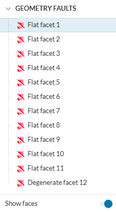

# 🏎️ Qualifying Lap — CFD  

"And here we are, lights out on the next stage of Project: Aero! The CAD lap is in the books, ST0 has rolled out of the garage, and it’s heading straight into the CFD arena. No wind tunnel, no factory-scale computers. Just me, SimScale, and a very nervous laptop fan."  

This part of the project is all about finding out if my RB19-inspired, regulation-legal, student-version-of-NX front wing can actually generate downforce… or if I’ve just built a very stylish drag machine.  

### 🎯 Goals  

- Import the geometry into SimScale and generate a clean mesh.  
- Run airflow simulations at baseline F1 speeds (~50 m/s to start).  
- Visualise pressure, velocity, and streamlines to understand behaviour.  
- See if the slot gaps and flap angles really do their job, or if I’ve engineered the world’s most expensive desk fan.  

### 🛠️ Tools  

- **SimScale** (meshing + solver + post-processing in one platform)  

---

Think of this as Q1 in qualifying: the aim isn’t to smash records yet, but to get a solid lap on the board. Once the pipeline works, we’ll push harder in Q2 and Q3 which means higher speeds, setup tweaks, and hopefully a lot more downforce.  

### 🧠 What I Expect to See  

- A clear pressure differential across the wing (high pressure above, low pressure below), confirming it generates downforce rather than lift.  
- Streamlines remaining attached through the slot gaps, if they detach too early, the wing stalls and performance drops off a cliff.  
- Evidence of Y250 vortex structures forming near the central section, helping control airflow downstream.  
- The outer flaps biasing flow outward around the tyres (like the RB19), reducing wake turbulence and drag.  
- Boundary layers that stay thin and attached, if they thicken or separate too much, I’ll know my flap angles were too aggressive.  

If I see these features, I’ll know the design philosophy was on the right track. If not… well, back to the CAD garage for ST1.  

### Qualifying 1

## Qualifying — SimScale notes

So we begin. New software, no idea what I’m doing. That’s fine. Fail fast, try again faster.

**Import and scale**

Imported the STL and the scale was wildly off.  
 

Scaled the model by a factor of **0.001** to convert mm → m.  

**Setup**

Created an external flow volume and set up an incompressible simulation.  
 

**What went wrong**

Then came the errors. Many of them.  
   
   

Tried everything I could think of: tutorials, docs, forums, even AI. Tweaked the model, repaired faces, changed the flow region, removed tiny slots. Still no joy. After four days it was clear the blocker was geometry integrity, not the physics setup.

