# 🏎️ Sprint Lap – 3D Printing  

*"Box now! Box! Box now box, for hard! Uh, STAY OUT, STAY OUT!"*  

Hello again! This time we’re doing something a lot easier: **3D printing the front wing!**
This should be quick, welcome to the sprint!  

---

## 🎯 Filament choice  

I bought CF PLA (carbon fibre PLA filament) for the print.  
[Link to the exact one I used](https://www.amazon.co.uk/FLASHFORGE-Filament-Dimensional-Lightweight-Heat-Resistant/dp/B0DHZQ8812/ref=sr_1_7?dib=eyJ2IjoiMSJ9.WuFrvd5-fzhBbLjLpIsEYK_rOOp7MpHopHjIkA7lXRj8lXz4k7e3wLJi6JaRUf8jL9lLcOEJSVRxzbGGFznK0edJv1PAF6WNp-D7-mt-smSubkE4kAx8XwDTyIZM6FurbALHPqd2gZaJbOWqmcrcK-7UvK-QfVXcW6_Fkx4LMMfJCL8XPsxfJ3YBkurMuMZ-iGxwtwl8UaPmpyfZN33lm59NaVq0fYPSCQWb5knJFWaWGaJyZxedjNXwgWZcdColCKG0K2QYZLQYN8qwF_rfk6j0yN42kdgkqkvp77bUus4.f3l7GlCDoZeJLk7zPmnToVySm3kOCLVjTsCdtgEdTnQ&dib_tag=se&keywords=carbon%2Bfibre%2Bfilament&qid=1758226459&sr=8-7&th=1).  

It’s only 10% carbon fibre but at £20 it’s decent for testing.  
(and good for a broke university student)

---

## 🖥️ Slicing setup  

Opened the ST0 model in Bambu Studio. Not my first time slicing, but definitely the first time at this scale.  

  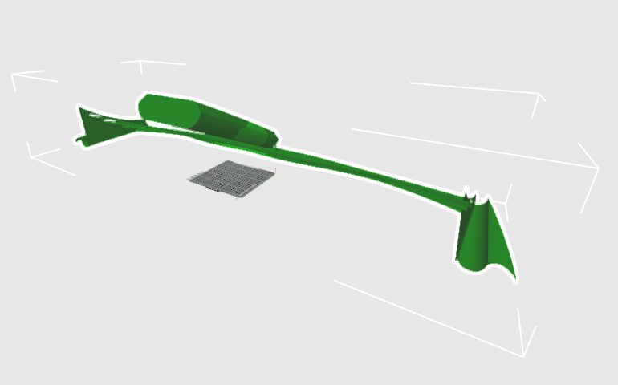
  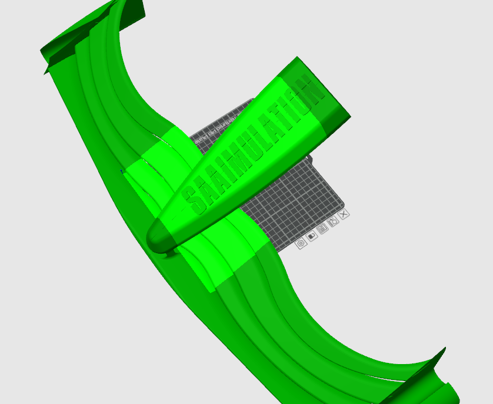

  

I cut the model into sections and placed them on separate build plates:  

  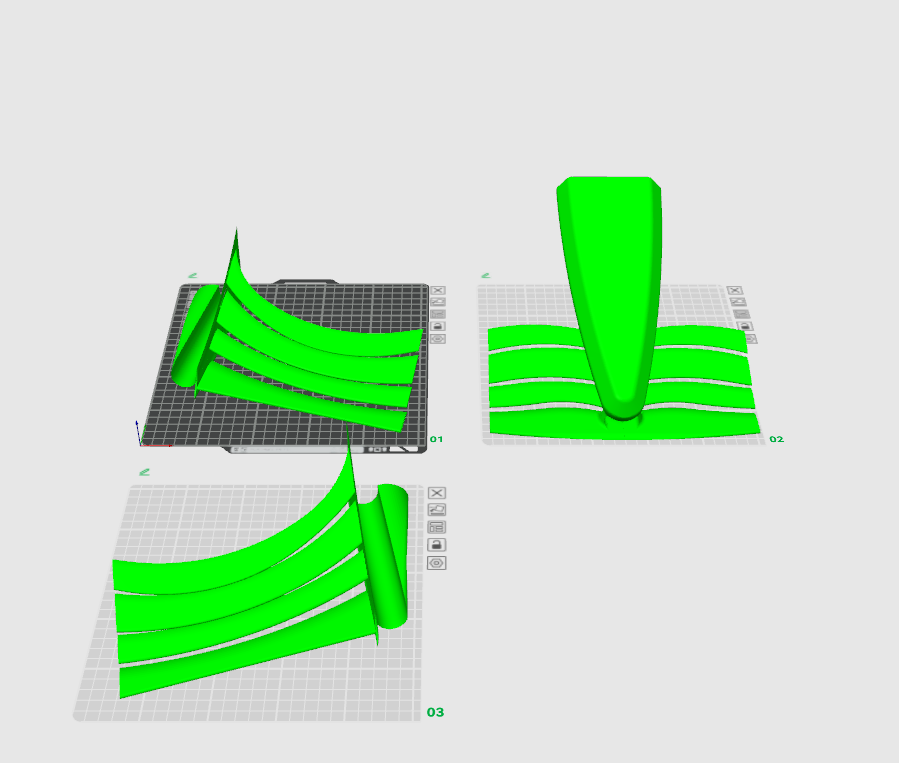

  

---

## 💥 First failed attempt

The first section was estimated at 8 hours… but not even 30 minutes in, disaster struck.
Supports failed, the print warped, and almost 400 g of filament was about to be wasted.

  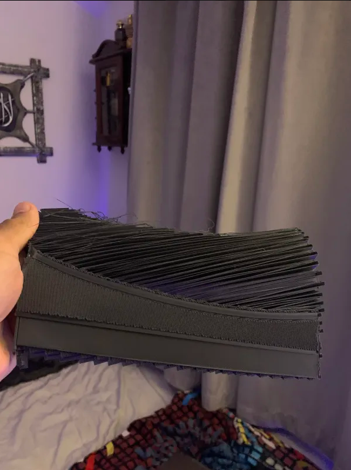

And honestly… this meme sums it up better than words:

  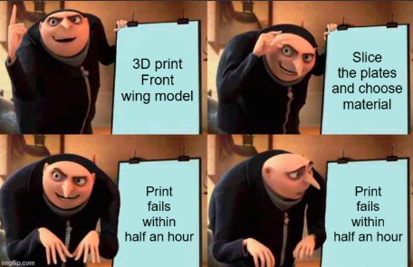

Lesson learned: at 30% scale, the flaps were only a few millimetres thick. Even if the print had finished, sticking the pieces together would’ve been a nightmare.

---

## ✅ New plan  

I decided to split this into two separate goals:  

1. A **display model** — larger scale, purely for my room.  
2. A **test model** — smaller, around 10–15% scale, for the wind tunnel.  

## 🖼️ Display - to admire in my room...

  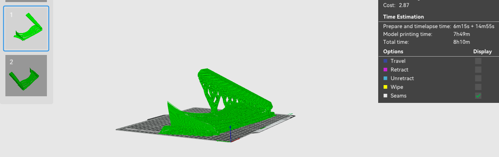
  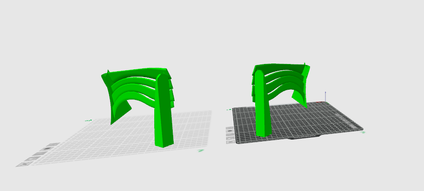

  

Rotating the wing nose-up reduced the supports under the thin flaps and saved print time + material.  

Final slicer check:  

  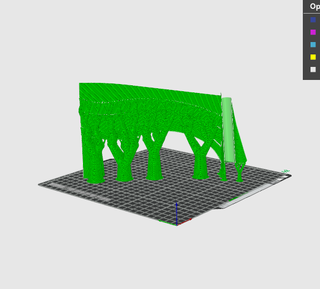

  

Now we wait 8 hours… fingers crossed this time.  

---

Couldn't sleep because of the whirring fans from the printer, but when it was done, it came out pretty well!  

  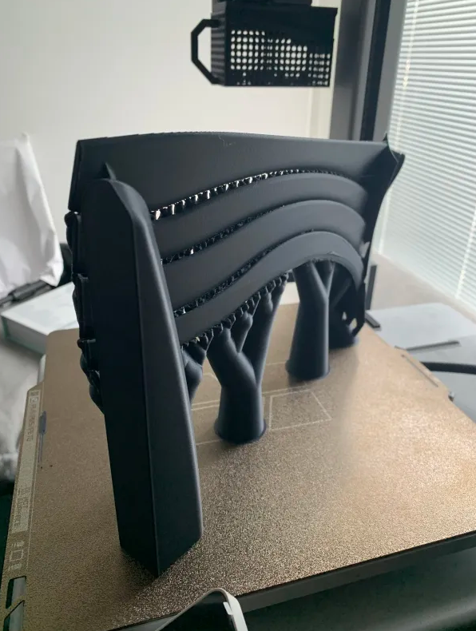
  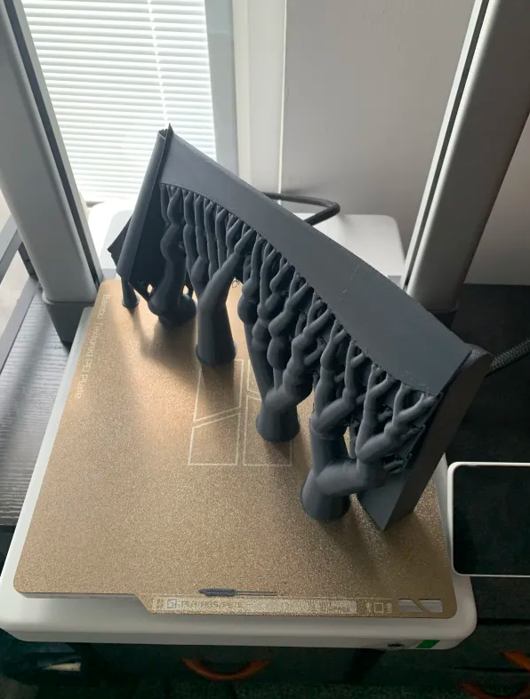

  

There was a lot of material used on the supports, but much less than the previous attempt because I managed to lower the infill and branch diameter!  

Here is how the print came out:  

  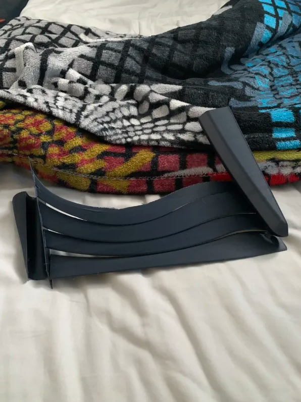

  

I realised one potential issue, a bit too late, which was the nose of the wing only being connected by a thin wall in the model.  

  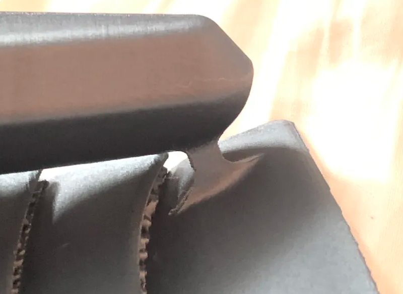

  

This is reflected in the 3D printed version too, but it will be fine after I join the two halves together, giving it more support.  
The edges have some imperfections, due to the small fillet angles on the back of the flaps, which became even smaller after scaling down.  

After printing the other half, I used superglue to assemble the wing.  
I originally planned to add mechanical connectors (rods and holes), but the flaps were too thin to handle drilling without breaking.  

  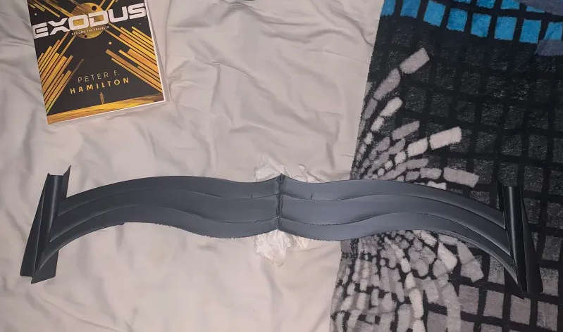

  

Here is the completed assembly at 35% scale:  

  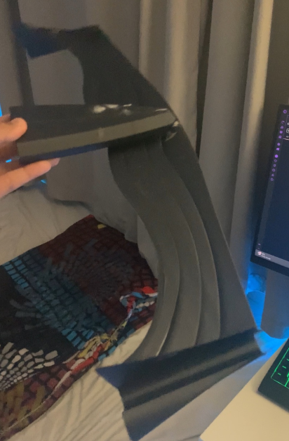
  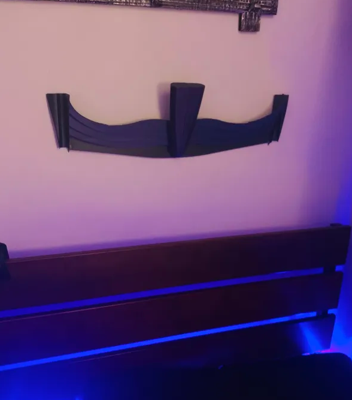

  

For mounting, I used 3M Command strips to attach the wing securely to the wall as a display piece.  

This part of the project taught me a lot about practical assembly and iteration:  
- How to optimise support structures and infill during slicing to reduce material waste.  
- How thin-walled aero components behave when scaled for printing, and the compromises needed for strength.  
- The effort required when transitioning a digital CAD model into a physical prototype suitable for display or testing.  

At 35% scale, the wing is already a huge presence in my room. It gives perspective on the real challenge in F1! 
Where teams build 60% scale wind tunnel models that are several metres wide. 
It’s incredible to think of the engineering effort that goes into those full aerodynamic programmes.  

## 🔬 Test - to visualise aerodynamics...  

This model is going to be used for the wind tunnel.  
In Formula 1, teams run their tunnel models at **60% scale** to balance cost and accuracy.  
I, however, need to balance filament, time, and my sanity — so I’m printing the wing at **10–15% scale**.  
This way I can still get useful results while keeping the tunnel small enough to build.  

To make it work, I added a **reinforced block** at the nose–flap junction.  
This secures the structure and gives me an area to drill into, so the model can be pinned to the wind tunnel wall for testing.  

  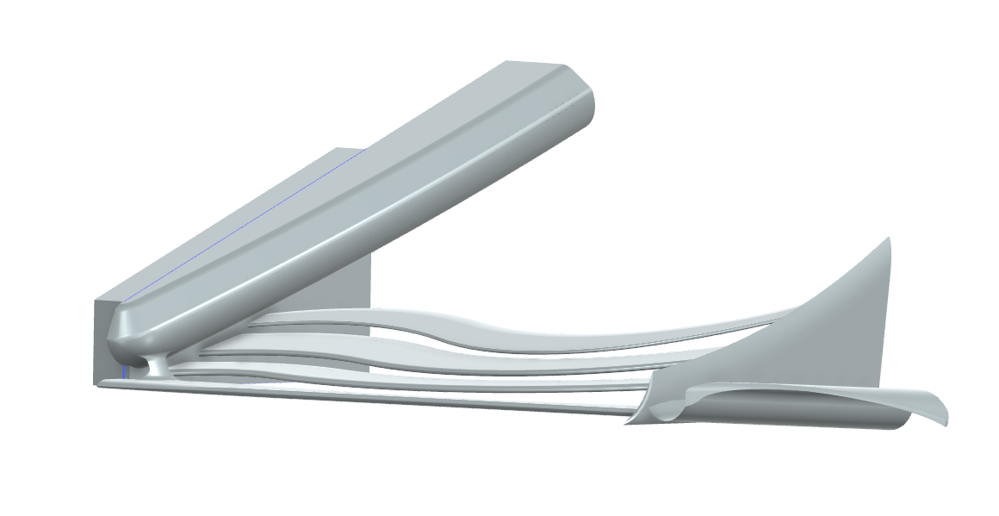

  

Deciding on **half-span vs full-span** was tricky.  
In the end, half-span works better for flow visualisation. With symmetry, I don’t need to worry about yaw effects, and I can focus purely on the flow.  

---

### ⚠️ First Attempt  

Printed at **12% scale, 30% infill**.  
It failed after 10 minutes…  

The end of the world? Almost.  

Just kidding.  

---

### 🔎 What Went Wrong  

1. **Endplate too thin** — at 12% scale it became translucent in slicing.  
   
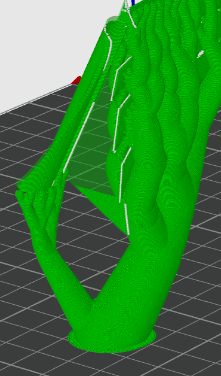
  

2. **Old model** — I accidentally used an earlier version with inaccurate fillets and gaps.  
   
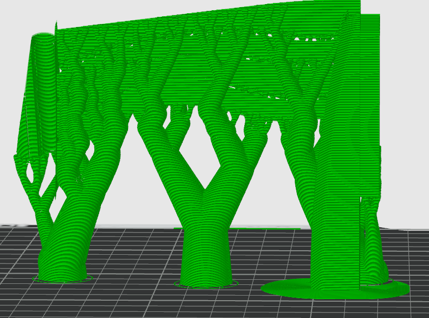
  

3. **Reinforcement block too small** — not enough surface area for drilling holes.  

---

### ✅ Fixes in the Next Iteration  

1. Thickened the endplate and tweaked the fillets to maintain aerodynamic efficiency.  
2. Used the updated CAD model, enlarging thin chamfers and angles for printability.  
3. Extended the reinforcement block to cover a wider base area.  

  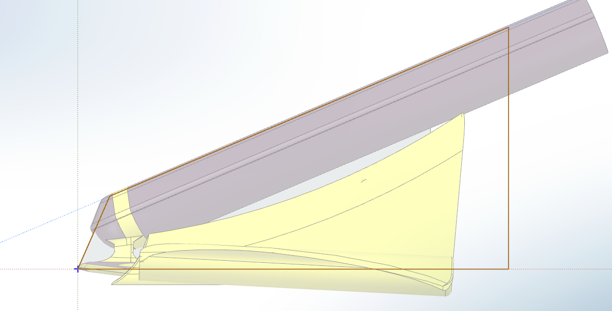
  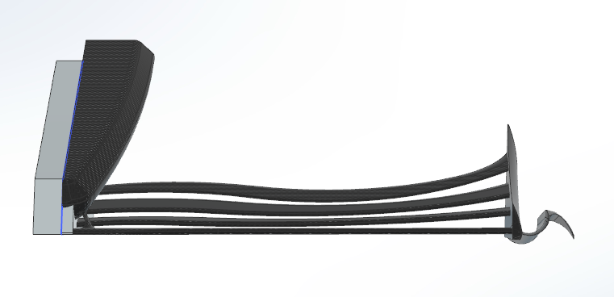

  

I also adjusted the slicer settings:  
- Increased the support angle threshold  
- Increased branch diameter for sturdier supports  

Now… time to print again!  

# 🎁 BONUS! Mini F1 Wing Keychains!!  

In the middle of doing these prints, I had an idea:  
what if I scaled the front wing *all the way down* into a keychain?  

At first it sounded like a gimmick, but it actually became a valuable mini project.  
It tested how well the design scaled, how durable the geometry was at very small sizes, and how engineering can be shared in an accessible, hands-on form.  

---

## 🔧 Redesign for strength  

To survive at 5% scale, the model needed changes:  
- Reduced fillets on the flaps (aero efficiency is pointless at keychain scale).  
- Removed the thin connection walls from the nose to the mainplane.  
- Lowered the nose and embedded the flaps directly for strength.  

  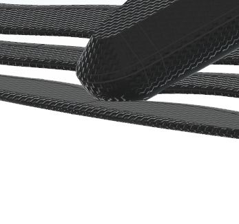
  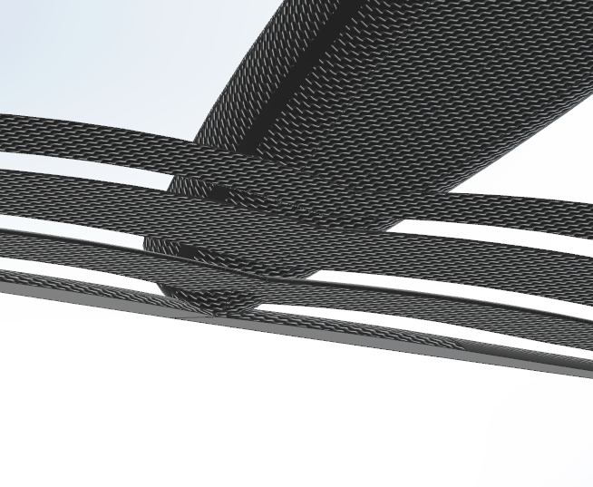

  

Slots in the endplate were also removed, since they would have weakened the print.  

  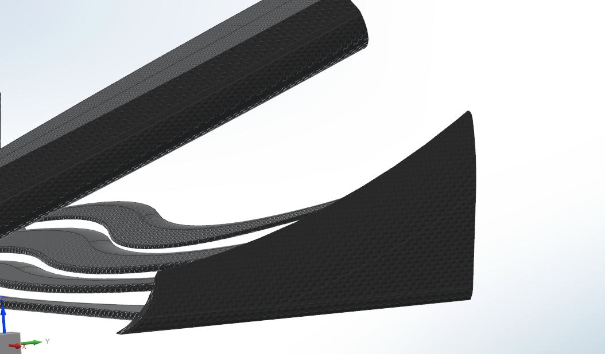

  

Finally, I added a small cut for the keyring loop.  

  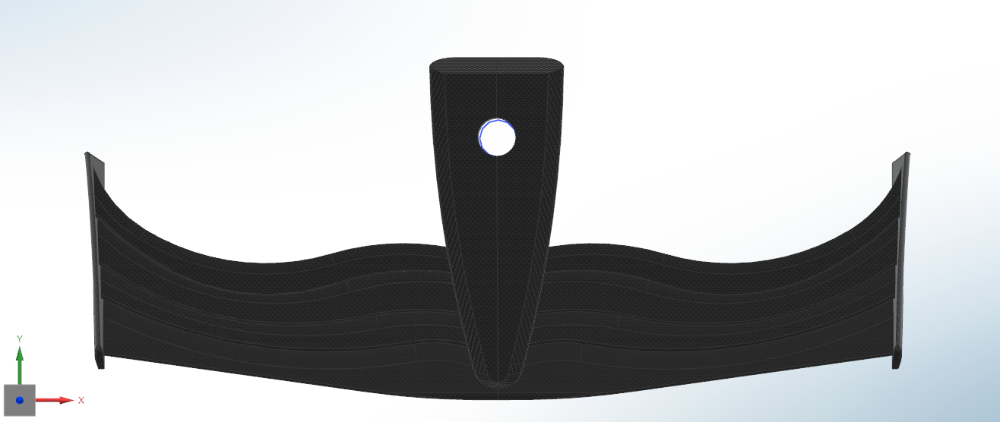
  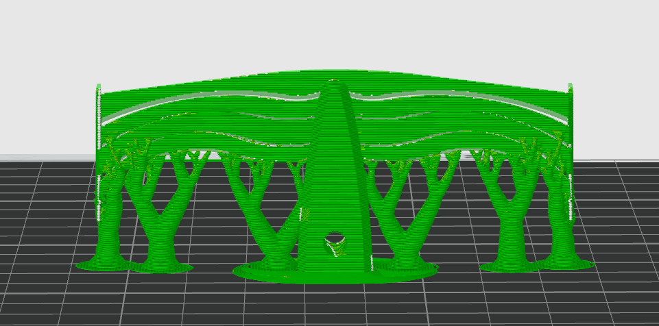

  

---

## 🖨️ First print  

Printed at **5% scale**:  

  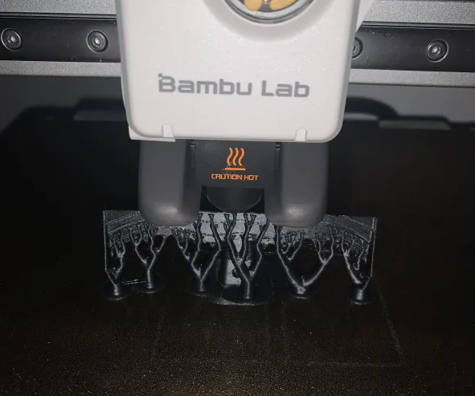
  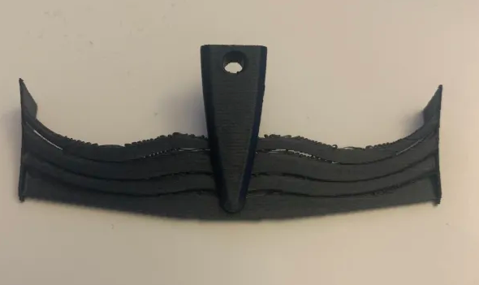

  

Surprisingly, it was flexible and strong. But the edges were too rough and the gaps between flaps looked messy.  

  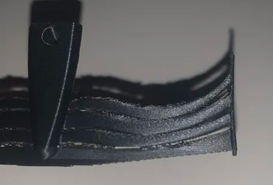

  

---

## ⚙️ Iteration  

I went back to the CAD, removed all edge fillets, and closed the gaps between the flaps.  
This improved both the look *and* the strength.  

The second version was printed at **4% scale** (yes, even cuter).  

  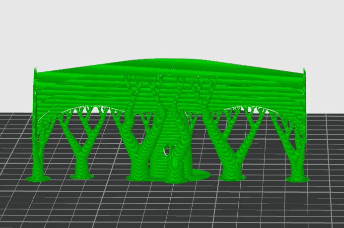

  

---

## 🏆 Results  

After **31 minutes** and just **3 g of filament**, I created the final version of this F1 wing keychain.  

This served as both a **durability test** and a way to share the project in a pocket-sized format.  
Instead of keeping the design locked away on CAD or CFD plots, it’s now something people can hold, use, and remember.  
As well as being visual proof of my CAD skills, and giving them as a gift to any interviewers I happen to meet. A nice gesture!

  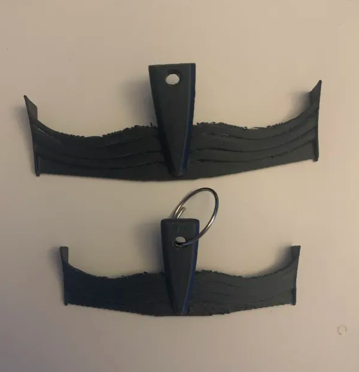

  

The bottom wing is the smaller, refined version. It still has some rough edges, but at that scale there isn’t much more I can do.  
Potential improvements could come with a 2 mm nozzle upgrade on my Bambu A1.  

---

This was a mini project to make engineering more accessible and shareable.  
Here’s the model if you’d like to print one yourself:  

👉 [FWKeyUpdated.3mf](./FWKeyUpdated.3mf)  

## 📚 Summary  

This sprint lap was all about turning CAD into something you can actually hold. From failed attempts to finished parts, I learned more about scaling, durability, and how small design choices show up in the real world once printed.  

Across the different versions, I was able to:  

- Create a display model at larger scale for visual impact  
- Produce a wind tunnel model at 15% scale for testing and CFD correlation  
- Design a mini keychain version as a durability test and a way to share engineering in an accessible, pocket-sized form  

Key takeaways:  

- Printing taught me how thin fillets and small gaps can make or break a design at scale  
- Orientation and slicing strategy are just as important as CAD design when it comes to structural success  
- Iteration is everything, each print failure gave me insights I wouldn’t have learned in CAD alone  

This stage has been both fun and technical, combining creativity with practical engineering. The wing isn’t just geometry on a screen anymore, it exists in carbon fibre PLA, glued together, keychained, and even tunnel-ready.  

The next stage is wind tunnel testing, which you can find here:  
[Project-Aero/grand-prix-wind-tunnel](../grand-prix-wind-tunnel)  

That’s all for this sprint lap. Time to take the next corner 😉  

